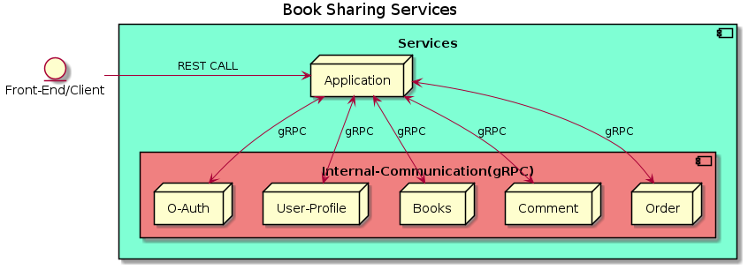
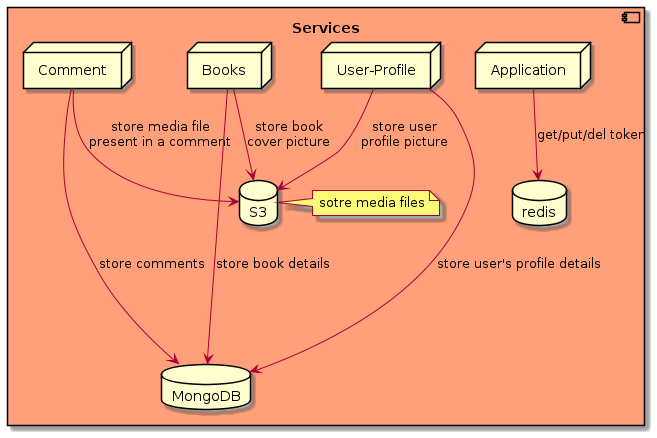

# book-labs

A platform allowing college student to share hard copy of book among themselves.

- [book-labs](#book-labs)
  - [Services](#services)
    - [Application](#application)
    - [O-Auth](#o-auth)
    - [User-Profile](#user-profile)
    - [Comment](#comment)
    - [Books](#books)
    - [Order](#order)

## Services

This application uses a micro-service architecture, with one service [Application](#application) responsible for exposing REST Endpoint for the client and routing user's request to required services. gRPC connection is ued for internal communication between the service.

**deployment**

### Application

Services responsible for routing, user's client to the respective service. This service exposes REST Endpoint which will be consumed by the front-end. Further routing of request to the various services done through gRPC connections.

### O-Auth

Service responsible for authenticating user's request to the book-sharing application.

### User-Profile

Service responsible for managing user's profile details.

### Comment

Service responsible for managing comment made by user on either on other user or on books.

### Books

Services responsible for managing books details.

### Order

Services responsible for managing orders placed by users for books.