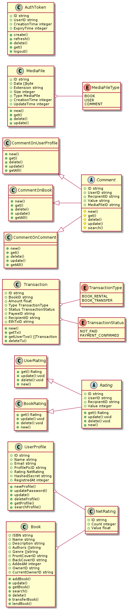

# Book Labs

A platform which allow college students to share their book (novel/academic/manga) with other students. The backend is developed on micros-service architecture with each service communicating with other via a gRPC connection.

- [Book Labs](#book-labs)
  - [Services](#services)
    - [Authentication](#authentication)
    - [Profile](#profile)
    - [Books](#books)
    - [Media Data](#media-data)
    - [Transaction](#transaction)
    - [Comment](#comment)
  - [Diagram](#diagram)
    - [Class Diagram](#class-diagram)

## Services

### Authentication

Service responsible for authenticating clients request having oAuth token assigned to each request.

### Profile

Service allowing user's to manage their profile and view others

### Books

Service responsible for managing all the books present on the platform.

### Media Data

Provide access to media data stored on this platform

### Transaction

Service responsible for managing all the transactions happing on this platform

### Comment

Service allowing user's to add comment to a users, books, or on another comment.

## Diagram

### Class Diagram

